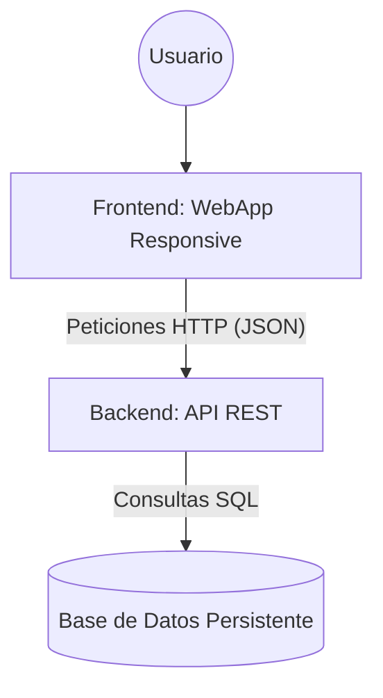

### Diagrama de Arquitectura
El sistema sigue un modelo **Fullstack** para garantizar la persistencia y disponibilidad:

### Descripción de Componentes:
1.  **Frontend:** Interfaz *Mobile-first* que permite al usuario interactuar con los flujos de registro y búsqueda.
2.  **Backend:** Procesa la lógica de negocio, valida los datos y actúa como puente entre la interfaz y la persistencia.
3.  **Base de Datos:** Garantiza que la información de los profesionales no sea volátil y persista tras reiniciar el sistema.
