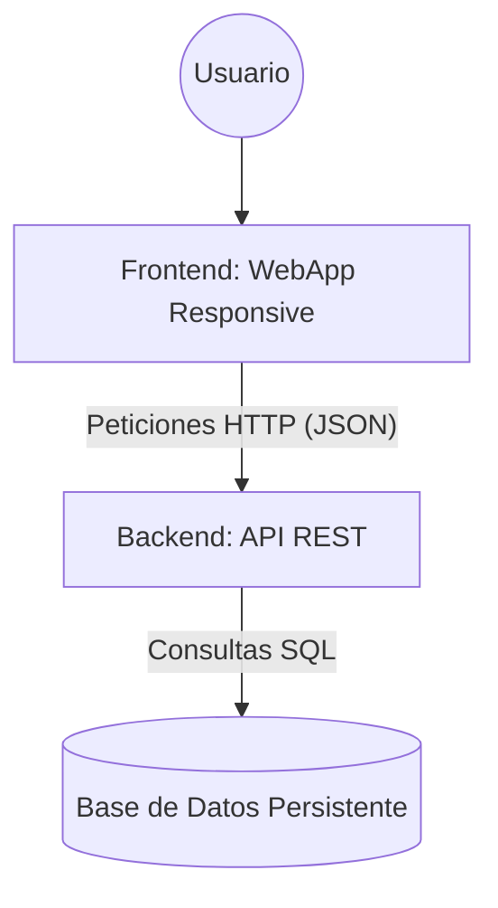

### Diagrama de Arquitectura
El sistema sigue un modelo **Fullstack** para garantizar la persistencia y disponibilidad:

### Descripción de Componentes:
1.  **Frontend:** Interfaz *Mobile-first* que permite al usuario interactuar con los flujos de registro y búsqueda.
2.  **Backend:** Procesa la lógica de negocio, valida los datos y actúa como puente entre la interfaz y la persistencia.
3.  **Base de Datos:** Garantiza que la información de los profesionales no sea volátil y persista tras reiniciar el sistema.

## Decisiones Técnicas

### Búsqueda de Profesionales (RF-02)
- **Decisión:** Se utilizará el operador `ILIKE` de PostgreSQL con comodines (`%`).
- **Razón:** Para permitir que los ciudadanos encuentren resultados aunque no escriban el nombre exacto del oficio o usen minúsculas (ej: buscar "plom" encontrará "Plomero"). 
- **Impacto:** Mejora la usabilidad y evita que el sistema parezca que no funciona

> **Estrategia Frontend (RNF-01):** Se utilizará un enfoque **Mobile-first** con CSS Flexbox para asegurar que la interfaz sea intuitiva en dispositivos móviles antes de escalar a escritorio.

### Seguridad y Comunicación (CORS)
- **Decisión:** Se configuró CORS en el backend para restringir el acceso únicamente al origen `http://localhost:5173`.
- **Razón:** Cumplir con el estándar de seguridad de navegadores y prevenir peticiones no autorizadas de dominios externos.