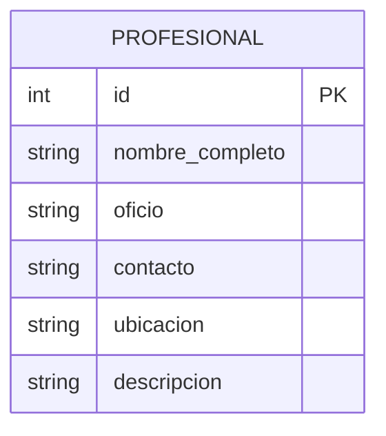

### Entidad: Profesional (o Trabajador)
Representa al prestador de servicios en el sistema.

**Atributos:**
1.  **id:** Identificador único (Primary Key).
2.  **nombre_completo:** Nombre del trabajador.
3.  **oficio:** Especialidad (ej. Plomero, Electricista) para facilitar la búsqueda.
4.  **contacto:** Teléfono o correo electrónico de contacto directo.
5.  **ubicación:** Ciudad o zona para filtrar resultados locales.
6.  **descripcion:** Breve resumen de los servicios ofrecidos.

Este modelo es **suficiente y completo** para soportar los flujos de Registro y Búsqueda requeridos.

